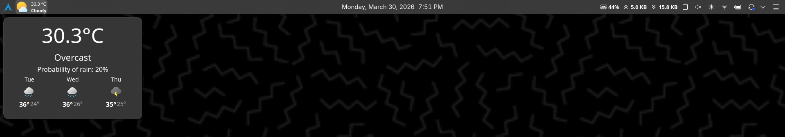
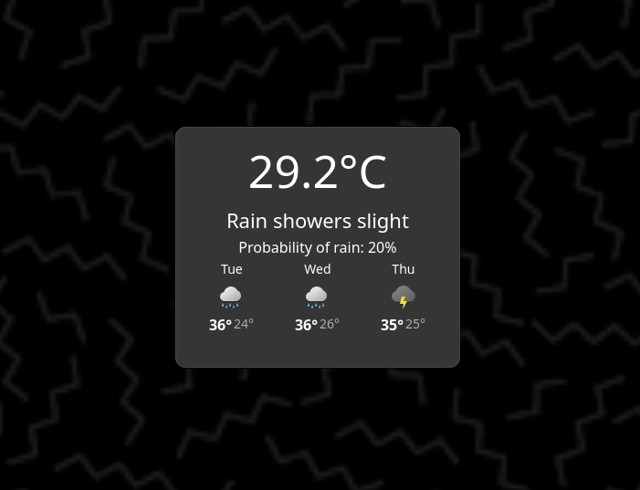
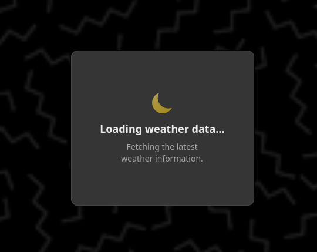

# Aero Weather

Aero Weather is a Plasma 6 weather widget focused on a clean desktop card view with compact panel support.

## Fork and Attribution

Aero Weather is a fork of Minimal Chaac Weather by zayronxio (Adolfo Silerio).

Upstream source repository: https://github.com/zayronxio/Chaac.Minimal.Weather

This project keeps upstream attribution and is distributed under GPL-3.0+.

## Features

- Direct weather card view on desktop
- Compact panel representation
- Current weather and multi-day forecast
- Custom font color in settings
- Loading, offline, and error states with retry messaging
- Automatic IP location or manual coordinates
- Celsius and Fahrenheit units

## Screenshots

On Panel example:

On Panel extended:

Desktop card:

Loading view:

## Build a Release Package

From the project root:

Replace 1.0.0 with the current version as needed.

1. mkdir -p release
2. zip -r release/Aero.Weather-1.0.0.plasmoid metadata.json contents LICENSE CHANGELOG.md README.md images

Note: Plasma 6 uses metadata.json. metadata.desktop is kept only for compatibility/tooling and is not required in the release package.

## Install Locally

From the project root:

Replace 1.0.0 with the current version as needed.

### First-time install

1. kpackagetool6 --type Plasma/Applet --install "$PWD/release/Aero.Weather-1.0.0.plasmoid"
2. kquitapp6 plasmashell
3. nohup plasmashell >/tmp/plasmashell-restart.log 2>&1 &

### Upgrade an existing install

1. kpackagetool6 --type Plasma/Applet --upgrade "$PWD/release/Aero.Weather-1.0.0.plasmoid"
2. kquitapp6 plasmashell
3. nohup plasmashell >/tmp/plasmashell-restart.log 2>&1 &

## Publish

Primary distribution target:

- KDE Store Plasma Widgets category

Package to upload:

- release/Aero.Weather-1.0.0.plasmoid

## Changelog

See [CHANGELOG.md](CHANGELOG.md).

## License

Licensed under GPL-3.0+.

See [LICENSE](LICENSE).
